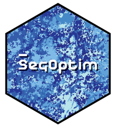

# SegOptim



<!-- badges: start -->

[](https://github.com/joaofgoncalves/SegOptim/actions) [](https://codecov.io/gh/joaofgoncalves/SegOptim)

<!-- badges: end -->

------------------------------------------------------------------------

## Package description

*SegOptim* is an R package for object-based image analysis (OBIA). It allows to run, compare and optimize multiple image segmentation algorithms in the context of supervised classification. It also allows to perform unsupervised classification with several different methods and compare them through internal clustering metrics.

-   For more details about installation and how to use the package go to the **tutorial** [here](https://segoptim.bitbucket.io/docs/).

-   Check also the **paper** describing the package functionalities [here](https://www.sciencedirect.com/science/article/pii/S0303243418303556).

-   For sorting out technical issues, contact us through the dedicated Google group [here](https://groups.google.com/forum/#!forum/segoptim-user-group).

## Installing the package

``` r

# [!] Due to the removal from CRAN of package unbalanced
# this has to be compiled from source and installed

remotes::install_github("dalpozz/unbalanced")


# Now let's install SegOptim (with the latest updates)

remotes::install_github("joaofgoncalves/SegOptim")
```

## Compatibility issues

?????? As of December 2023 (version 0.3.0), `SegOptim` moved to the `terra` package as a support for raster data due to the retirement of `sp`, `rgeos`, `rgdal`, `maptools` and, `raster` packages.

For this reason, older scripts (prior to v-0.3.0) will not be compatible with `SegOptim`'s current version and need to be updated. Sorry for any inconvenience this may cause ????

## Functionalities

Currently the package offers several functionalities, namely:

-   Run different image segmentation algorithms;

-   Populate image segments with aggregate statistics (using pre- and/or user-defined functions;

-   Perform object-based supervised classification with several different methods;

-   Evaluate classification performance for single- or multi-class problems;

-   Optimize image segmentation parameters using Genetic Algorithms (GA) and other methods;

-   Compare different algorithms based on optimized solutions;

-   Perform unsupervised classification with several methods and compare the results using internal clustering criteria.

## Available algorithms

### Image segmentation algorithms

*SegOptim* allows comparing multiple algorithms both for image segmentation, supervised and unsupervised classification.

Currently, the following methods are available for **image segmentation**:

-   **ArcGIS** Mean-shift ([link](http://desktop.arcgis.com/en/arcmap/10.3/tools/spatial-analyst-toolbox/segment-mean-shift.htm));

-   **GRASS GIS** Region Growing ([link](https://grass.osgeo.org/grass73/manuals/i.segment.html));

-   **Orfeo ToolBox (OTB)** Large-scale Mean-shift ([link](https://www.orfeo-toolbox.org/CookBook/Applications/app_MeanShiftSmoothing.html));

-   **RSGISLib** Shepherd's k-means ([link](http://www.rsgislib.org/rsgislib_segmentation.html));

-   **SAGA GIS** Seeded Region Growing ([link](http://www.saga-gis.org/saga_tool_doc/4.0.1/imagery_segmentation_3.html)).

-   **TerraLib 5** Baatz-Schape Multi-resolution segmentation and Mean Region Growing ([link](http://www.dpi.inpe.br/terralib5/wiki/doku.php?id=start))

### Supervised classification algorithms

As for **supervised classification**, the following methods are available through *R*:

-   Flexible Discriminant Analysis (**FDA**) ([link](https://CRAN.R-project.org/package=mda));

-   Generalized Boosted Model (**GBM**) ([link](https://CRAN.R-project.org/package=gbm));

-   K-nearest neighbor classifier (**KNN**) ([link](https://CRAN.R-project.org/package=class));

-   Random Forest (**RF**) ([link](https://CRAN.R-project.org/package=randomForest));

-   Support Vector Machines (**SVM**) ([link](https://CRAN.R-project.org/package=e1071)).

### Unsupervised classification algorithms

Regarding **unsupervised classification**, *SegOptim* supports the following algorithms:

-   CLARA (Clustering LARge Applications) ([link](https://CRAN.R-project.org/package=cluster))

-   Hard competitive learning algorithm ([link](https://CRAN.R-project.org/package=cclust))

-   K-means ([link](https://stat.ethz.ch/R-manual/R-devel/library/stats/html/kmeans.html))

-   Neural gas algorithm ([link](https://CRAN.R-project.org/package=cclust))

The support for (internal) clustering criteria used for comparing each unsupervised solution is given by the **clusterCrit** package ([link](https://CRAN.R-project.org/package=clusterCrit)).

## Limitations

Currently, *SegOptim* has several limitations that derive from design decisions that were made during development stages and, to be completely honest, the fact that we are not software developers... (sorry for that ;-). Among other, these limitations are:

-   Memory restrictions (especially for large images);

-   Computational complexity and workload (especially for applying optimization);

-   No pre-processing for satellite data;

-   Only allows single-stage classification;

-   It does not allow to explore hierarchical or spatial relations among or between objects;

-   No post-classification processing;

-   Although tests have been successfully accomplished in several operating systems, Windows is for now the most supported one.

We are planning to add new features and to address some of these limitations in future releases however this is the *status quo*! ;-)

## News

#### version-0.3.0

-   SegOptim moved to the terra package as a support for raster data due to the retirement of `sp`, `rgeos`, `rgdal`, `maptools` and, `raster` packages.

#### version-0.2.4

-   SegOptim now supports the calculation of segment statistics by tiles greatly reducing memory usage

#### version-0.2.3

-   Corrects a bug in the calculation of Normalized Difference Indices

-   Implements the calculation of segment statistics by layer in `prepareCalData()` function

-   Greatly improves the speed of `predictSegments()` function using `data.table` objects

-   Other misc bug fixes and corrections

#### version-0.2.2

-   Corrects a couple of bugs

-   Adds the possibility to define available RAM in OTB segmentation
